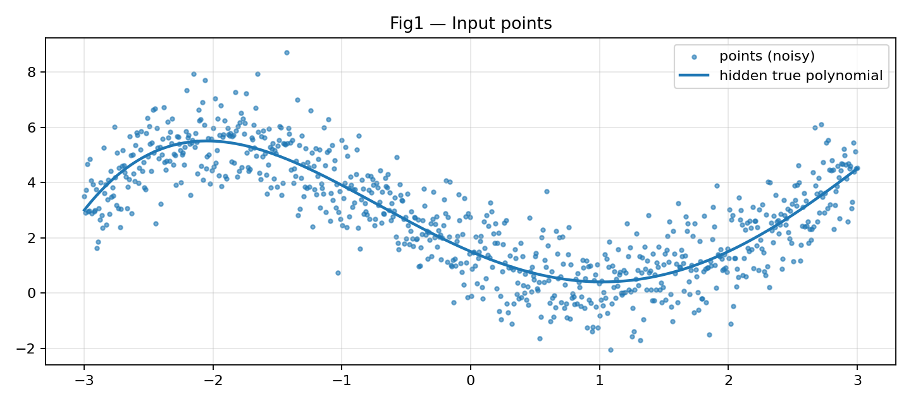
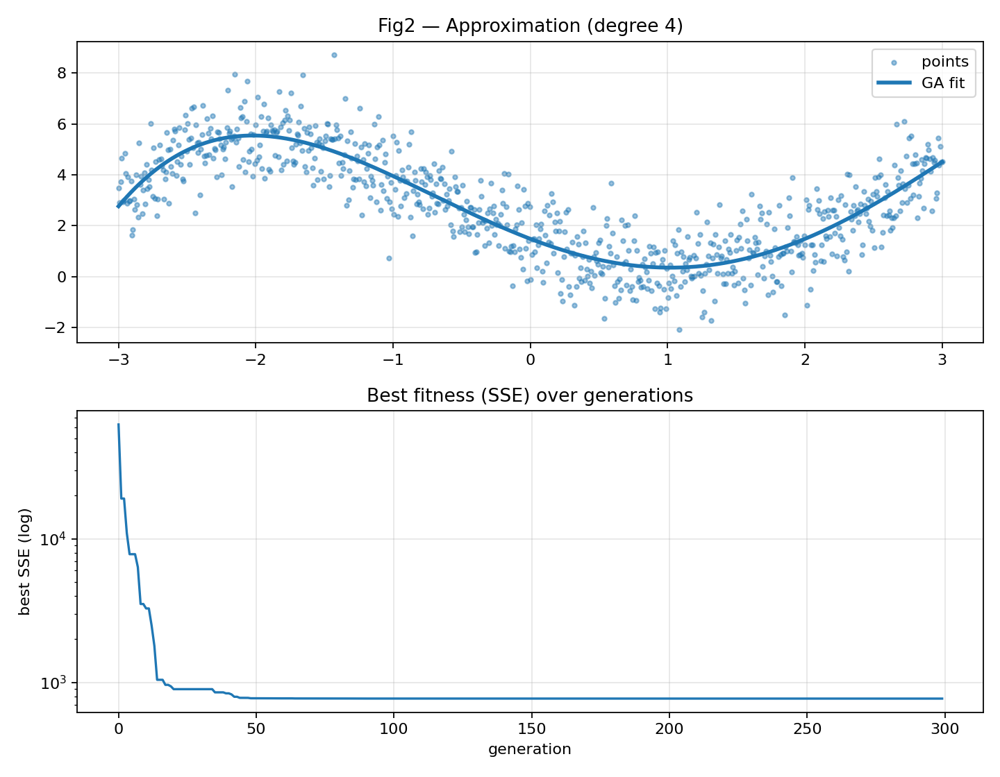

## Генетический алгоритм: аппроксимация полиномом степени 4

# Выполнил: Васильев Артём
# Курс: Высокопроизводительные вычисления, Самарский университет

В этой папке лежит решение задачи из `genetic_algorithm.pdf`: по набору точек \((x_i, y_i)\) подобрать коэффициенты полинома степени не выше 4,

\[
g(x) = \sum_{k=0}^{4} c_k x^k,
\]

так, чтобы ошибка аппроксимации была минимальной.

---

## Коротко о подходе

- **Индивид**: вектор коэффициентов \([c_0, c_1, c_2, c_3, c_4]\).
- **Fitness** (как в разделе *Proposed method*): сумма квадратов ошибок (SSE)
  \[
  \sum_i (g(x_i) - y_i)^2
  \]
  Чем меньше значение — тем лучше решение.
- **Селекция**: сортировка популяции по fitness (лучшие — в начале) + сохранение лучшей особи (элитизм).
- **Кроссовер**: single-point crossover по позициям коэффициентов.
- **Мутация**: случайно выбранные гены «шевелятся» добавлением гауссовского шума; количество мутаций задаётся через параметры \(E_m\) и \(D_m\).
- **Остановка**: `maxIter` или отсутствие улучшения лучшего fitness в течение `maxConstIter` поколений.

---

## Иллюстрации

**Fig1.** Пример входных данных (точки).



**Fig2.** Результат аппроксимации найденным полиномом и динамика лучшего fitness по поколениям.



---

## Что лежит в папке

```text
CudaGeneticAlgorithm/
├── CMakeLists.txt
├── genetic_algorithm.pdf
├── HPC_Genetic_6131.ipynb   # решение в формате ноутбука (по этапам)
├── fig1.png                  # входные точки (пример)
├── fig2.png                  # аппроксимация + сходимость (пример)
├── src/, include/             # C++/CUDA реализация ГА
└── README.md                 # этот файл
```

---

## Запуск

Откройте `genetic_algorithm.ipynb` и выполните все ячейки.

Минимальные зависимости:

```bash
python -m pip install -U numpy matplotlib notebook
jupyter notebook
```
