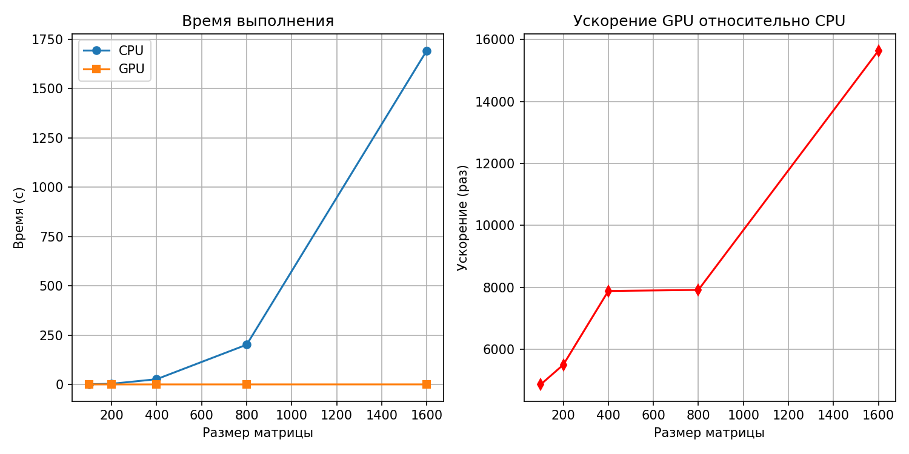
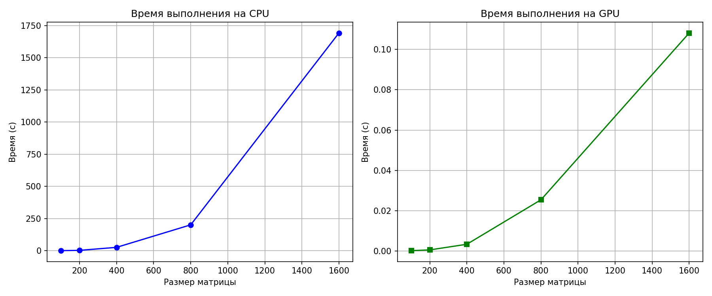

## Задание на лабораторную работу: 
Задача: реализовать алгоритм перемножения матриц

Язык: C++ или Python

Входные данные: 2 матрицы размером от 100х100 до 2000х2000 каждая.

Выходные данные: проверка корректности перемножения + время вычисления

Реализация должна содержать 2 функции перемножения матриц: на CPU(mult_matr_cpu) и на GPU(mult_matr_gpu) с применением CUDA.

## Язык программирования и среда разработки
Язык: Python
Среда: Google Collab

## Описание реализации

Для **CPU** используется функция `mult_matr_cpu`, реализующая умножение матриц с помощью трёх вложенных циклов: внешний цикл проходит по строкам матрицы A, средний — по столбцам матрицы B, а внутренний выполняет вычисление скалярного произведения соответствующих элементов строки и столбца. В результате функция возвращает матрицу произведения и затраченное время вычислений.

Для **GPU** применяется функция `mult_matr_gpu`: сначала исходные матрицы копируются с хоста на устройство, затем выделяется память под результирующую матрицу. После этого настраивается сетка потоков и число блоков. Перед основными вычислениями выполняется «прогрев» CUDA, поскольку первая JIT-компиляция занимает больше времени, чем последующие запуски. В функции `mat_mul` (вызываемой внутри `mult_matr_gpu`) используется один цикл, при этом каждый поток вычисляет свой элемент C[i; j]. В результате функция возвращает матрицу произведения и среднее время выполнения по всем запускам.

## Для чего используется распараллеливание?

1) Высокая сложность. Рассмотрим функцию CPU. За счет 3 вложенных циклов ее сложность - O(n^3). То есть время, которое затрачивается на выполнение задачи, измеряется в секундах, а то и минутах.
2) Независимость вычислений (подразумевается, что выполнение операций не зависит от предыдущих действий).

## Что распараллеливаем? 

В CPU-версии три вложенных цикла:
1) По строкам i
2) По столбцам j
3) По общему индексу k (скалярное произведение)

Распараллелены два внешних цикла (i и j). В версии для GPU они полностью исчезли. Вместо того чтобы один процессор последовательно обходил каждую ячейку матрицы одну за другой, видеокарта берет на себя вычисление всех ячеек одновременно.

## Механизм

Распараллеливание достигнуто за счет архитектуры CUDA и библиотеки Numba.

1. Индексация осуществляется с использованием потоков (`cuda.grid(2)`): каждому потоку на GPU присваиваются уникальные индексы i (строка) и j (столбец).
2. Вместо последовательного вычисления всей матрицы одной функцией запускается множество экземпляров функции `gpu_mat_mul`, где каждый поток отвечает за вычисление конкретного элемента матрицы.
3. Матрица разбивается на блоки потоков, которые распределяются между мультипроцессорами видеокарты, что обеспечивает эффективное использование вычислительных ресурсов GPU.

Внутри каждого потока остался один цикл for k in range(A.shape[1]). Вычисление скалярного произведения (сумма произведений элементов строки на элементы столбца) в данном конкретном коде выполняется последовательно внутри каждого потока.

## Результаты эксперимента

| Размер | Время CPU (мс) | Время GPU (мс) | Ускорение | Корректность CPU | Корректность GPU |
|-------:|----------------:|----------------:|----------:|-----------------:|-----------------:|
|    100 |        0.908691 |        0.000187 | 4869.224372 |             True |             True |
|    200 |        2.992512 |        0.000544 | 5502.795212 |             True |             True |
|    400 |       26.330500 |        0.003340 | 7882.629623 |             True |             True |
|    800 |      201.121941 |        0.025402 | 7917.497980 |             True |             True |
|   1600 |     1691.686282 |        0.108167 | 15639.590012|             True |             True |

Время выполнения как на GPU, так и на CPU возрастает экспоненциально, хотя при наложении графиков может создаваться впечатление линейного роста для GPU. Ускорение увеличивается достаточно быстро, близко к экспоненциальной зависимости, что объясняется значительно более быстрым ростом вычислительной сложности на CPU по сравнению с GPU, и, как следствие, более существенным увеличением времени выполнения на CPU. Все полученные результаты являются корректными и совпадают с эталонной матрицей с точностью до пятого знака.

## Итог

Результаты реализации показывают, что применение распараллеливания в данной задаче несет значительную экономию времени, что ускоряет процесс работы.
