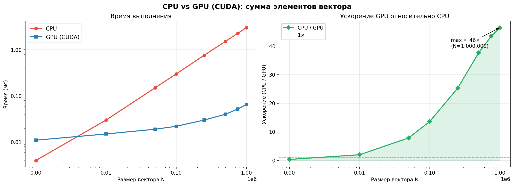

# Лабораторная работа 2. Сумма элементов вектора на CPU и GPU

**Автор**: Васильев Артём 
**Дисциплина**: «Высокопроизводительные вычисления», Самарский университет

---

## Постановка задачи

Нужно посчитать сумму элементов вектора

\[
S = \sum_{i=0}^{N-1} v_i
\]

двумя реализациями:

- последовательная версия на **CPU**;
- параллельная версия на **GPU** (CUDA).

В экспериментах размер \(N\) варьируется от 1 000 до 1 000 000.  
Для каждого \(N\) фиксируется время выполнения и ускорение GPU относительно CPU.

---

## Как устроено решение

- **CPU**: прямой проход по массиву в цикле `for` (см. `cpu_sum.cpp`).
- **GPU**: редукция по блокам:
  - каждый блок из 256 потоков обрабатывает свой кусок входного вектора;
  - частичные суммы накапливаются в `shared memory`;
  - блок пишет один итог, после чего частичные суммы объединяются на CPU.
- **Замеры**: CPU — `std::chrono`, GPU‑ядро — CUDA events.
- **Проверка корректности**: сравнение результата GPU с CPU‑эталоном при допуске `ε = 1e-3`.

---

## Наблюдения по результатам

На небольших \(N\) GPU уступает из‑за накладных расходов (запуск ядра/копирование данных).  
Примерно начиная с `N ≈ 50 000` ускорение становится заметным; при `N = 1 000 000` достигается порядка **~47×**.



---

## Состав репозитория

```text
CudaVectorSum/
├── CMakeLists.txt
├── README.md
├── include/            # cpu_sum.h, gpu_sum.h
├── src/                # cpu_sum.cpp, gpu_sum.cu, main.cpp
├── results.csv         # измеренные времена и ускорение
└── lab1.ipynb          # разбор результатов и графики
```
